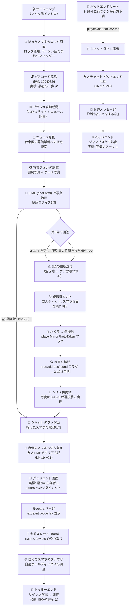

# ストーリー全体レビュー：〇ンニク〇んこつラーメン

## 全体の物語構造



---

## チャットシナリオ インデックスマップ

| idx | thread | sender | 内容 | トリガー |
|-----|--------|--------|------|----------|
| 0〜5 | friend | recv/sent | 初期会話（友人からの連絡） | `openThread()` 最初の起動 |
| 6〜9 | friend | sent/recv | ロック解除後の会話 | `doUnlock()` 後、flipDevice |
| 10〜12 | friend | sent/recv | ニュース発見後の会話 | `advanceStep('news_found')` 後、flipDevice |
| 13〜18 | friend | recv/sent | **空き地送信後の鏡ヒント** | `firstAddressSent` フラグ ON |
| 19 | friend | sent | 「充電が切れた！」（グッドエンド） | `triggerShutdownSequence('clear')` |
| 20〜21 | friend | recv | ケンの配信でのクリア報告 | 上に続く自動進行 |
| **22** | friend | recv | 「お前すごいことしたぞ！」 | 上に続く自動進行 |
| — | — | — | `playerChatIndex===22` → `triggerClear()` 発火 | — |
| 22〜26 | **taro** | recv/sent | 太郎からのお礼 + 追加依頼 | `/extra` ページ、`proceedToExtraStory()` |
| 27 | friend | sent | 「充電が切れた！」（バッドエンド） | `triggerShutdownSequence('bad_end')` |
| 28〜30 | friend | recv | バッドエンド会話 | 上に続く自動進行 |
| — | — | — | `playerChatIndex===31` → 脅迫 → `triggerBadEnd()` | — |

> [!WARNING]
> **インデックス22の二重使用に注意！**
> 配列インデックス`22`は`thread:'taro'`のメッセージですが、`renderNextPlayerMessage()`では`playerChatIndex === 22`で`triggerClear()`を呼び出します。これは「インデックス21（友人スレッドの最後 "お前すごいことしたぞ"）を描画した後、22に到達したとき」にクリア発火、という意図です。ただし`PLAYER_CHAT_SCENARIO[21]`が`recv`送信後に`playerChatIndex++`で22になり`triggerClear()`が呼ばれる流れのため、**太郎スレッドのindex 22のメッセージ自体はこのタイミングでは描画されない**という設計になっています。実質的には問題ないですが、紛らわしい。

---

## ゲームステート遷移

```
intro → unlocked → news_found → location_spec → chat_sent → clear
                                                           ↘ bad_end
                                                              ↘ true_end (別URL: /extra)
```

---

## 🐛 バグ・懸念点

### 1. バッドエンドのシャットダウン分岐

`triggerShutdownSequence()` 内で：

```js
if (endType === 'clear') {
  playerChatIndex = 19; // グッドエンド
} else {
  playerChatIndex = 29; // バッドエンド ← ⚠️ idx 27 に変更すべきでは？
}
```

**現在の `PLAYER_CHAT_SCENARIO`** ではバッドエンドのシャットダウン後会話は **index 27** から始まります（`{ thread: 'friend', sender: 'sent', text: 'あっ、拾ったスマホの充電が切れちゃった…！' }`）。しかし上記コードでは `29` を指定しており、**「充電が切れた！」メッセージ（idx 27）と最初の友人メッセージ（idx 28）をスキップ**してしまいます。

→ `playerChatIndex = 27;` に修正が必要かどうか確認を推奨。

### 2. バッドエンド判定のインデックス

`renderNextPlayerMessage()` でバッドエンドは `playerChatIndex === 31` で発火します：

```js
if (activePlayerThread === 'friend' && playerChatIndex === 31) { ... }
```

しかし配列に存在するバッドエンド会話は **idx 27〜30**（4件）なので、30番目（最後）を描画して `++` すると `31` になる。計算上は合っていますが、**idx 29のコメントが「インデックス 27〜30」と書かれているのに、コード上は1つずれて 27〜30を描画する設計**になっており、今後の変更時に混乱しやすい。

### 3. `retryFromBadEnd()` の挙動

```js
playerChatIndex = 13; // チャットインデックスを巻き戻す
saveState();
location.reload();
```

リロード後の `stepIndexMap` では `'news_found': 13` になっているため、`renderPlayerChat()` が idx 0〜13 を描画します。ただし `firstAddressSent: true` なので `renderLimit` は 13 で止まらず（上限はそのままになる）、正常に動作する見込みです。問題なし。

### 4. `activePlayerThread` の初期化タイミング

`activePlayerThread` はモジュールスコープで宣言されていますが、初期値が定義されていません（`let activePlayerThread;` のみ）。`isExtraMode` でない通常起動時に `DOMContentLoaded` の中で `activePlayerThread = 'friend'` に設定されますが、その前に `openThread()` 等が呼ばれた場合に `undefined` になる可能性があります。

---

## ✅ 良い点・注目すべき設計

| 項目 | 評価 |
|------|------|
| チャットの `thread` フィールド追加 | ✅ 友人 / 太郎スレッドの分離が明確になった |
| `/extra` への完全な URL 遷移 | ✅ 状態引き継ぎ（`taroChatIndex`）もケアされている |
| `saveState()` でiframeにブロードキャスト | ✅ 子iframe（browser/sns）との状態同期が自動化された |
| `retryFromBadEnd()` の部分ロールバック | ✅ 全リセットなしで実績が保持されるUX改善 |
| `restartGamePreservingUnlocks()` | ✅ 周回プレイへの配慮が良い |
| バッテリー演出のステップ連動 | ✅ `syncBatteryFromStep()` でゲーム進行と自然に連動 |

---

## 📋 未実装・要確認リスト

- [ ] `/extra` ページ（`extra.astro`）の実装内容の確認
- [ ] `extra-intro-overlay` のHTML要素の存在確認
- [ ] `true-end-overlay` の実装確認
- [ ] `trueAddressFound` フラグを立てるロジックの確認（`inspectPlayerMirrorPhoto()` → どこでセット？）
- [ ] バッドエンドのシャットダウン後チャットインデックス（29 vs 27）の検証
- [ ] `activePlayerThread` の初期値の明示的な定義
